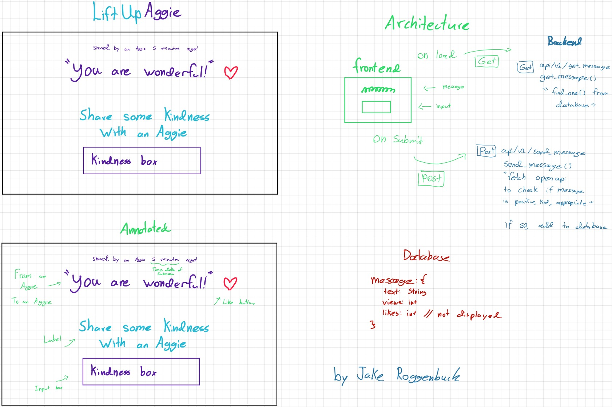

# UpLiftAggie
Send a positive message to an Aggie! Simple can be powerful.

## Technical
- Use OpenAI's gpt-3.5-turbo model to determine if messages are positive for content moderation
- Use FastAPI to receive and store messages
 

